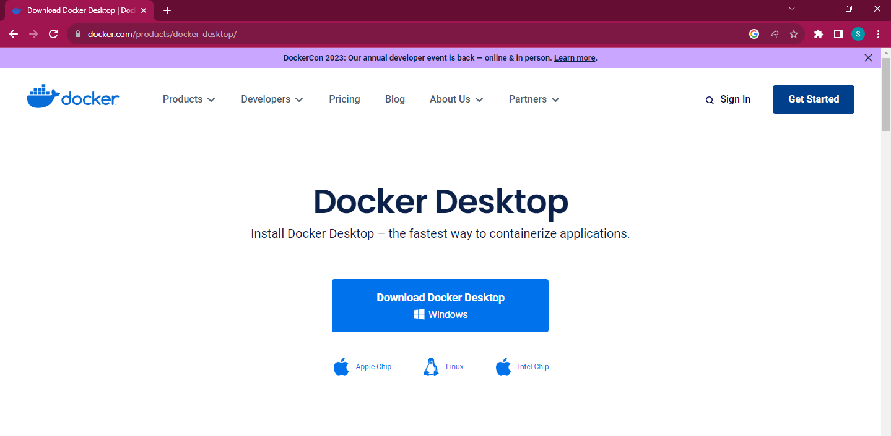

# Documentation
*Theme Name :* Simple Node.js Project Can Be Run Inside Docker Container

*Author :* Sarra Nutrisia

*Created :* 28/07/2023 

*HTML Version :* HTML 5

*Docker Version :* 24.0.2, build cb74dfc

*Node.js Version :* 18.17.0

***
If you have any questions about this project, feel free to e-mail me at **sarra.nutrisia@gmail.com**
***
## Table of Contents
1. app.jss (Simple Node.js file)
2. README.MD (Documentation file)
3. Images (Folder contain images)
4. Package.json
5. Dockerfile
6. .dockerignore
   
***
# How to Dockerize Simple Node.js Project

This Weekly Assignment (Assignment Week-6) is about how to running simple Node.js project inside docker container. There are few steps you can through as follows : 
  

## 1. Install Docker on Your Computer / Laptop

- Search and download Docker with latest update version on your machine.
  

  

- Then Update Windows Subsystem Linux (WSL) if there is required and follow the instruction by running   "wsl --update" on windows command prompt or follow the instruction at https://docs.microsoft.com/windows/wsl/wsl2-kernel.
  

- After the installation was success, then sign in to create account in Docker by input your username, email and password.

- Also verify the installation by typing "docker --version" in Windows Command Prompt.

## 2. Setting Node.js Project

- Copy simple Node.js project from : https://gist.github.com/berdoezt/e51718982926f0caa3fcd8ed45111430
  

- Paste that Node.js project to Visual Vode Studio and name the file "app.js".
  

- Create package.json file contains name, version, description, author, main, scripts and dependancies (framework).
  

- Create Dockerfile contains FROM (version of node.js), WORKDIR (spesific location of working directory), COPY (copying spesific file from local source into container), RUN (install all the depedencies that needed from package.json), COPY . . (copying all files from local source into container), EXPOSE (container listens on the specified network ports at runtime) and CMD (specifies the command to run when a container is launched).
  

## 3. Dockerize The Project

- Build the image by typing command on your terminal as per below and then press "Enter" key. 
  
  

- Then typing command on your terminal to input the image into container as per below and then press "Enter" key.
  
  

- After that, run the container by typing command on your terminal as per below and then press "Enter" key. (Port 3001 on left side shows port on your local machine and port 3001 on right side shows port from the container itself, they are connected each other)
  
  

- If the container ran successfully, Docker Desktop will show "2023-07-28 19:58:53 Server running at http://0.0.0.0:3001/".
  
  

## 4. Check The Result

- Open your browser and then type "localhost:3001" (the number comes from your local port machine) and press "Enter" key. The words will come out as "Hello World" on your browser.

  

***

#### Theme by Sarra Nutrisia
If you have any other questions that aren't covered in the documentation, feel free to e-mail <sarra.nutrisia@gmail.com>.
